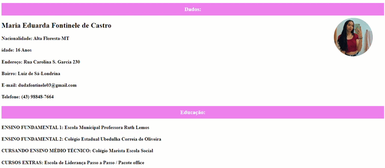

# GIF Currículo

## Descrição
Neste trabalho, construímos nosso currículo na disciplina de Lingua Portuguesa e criamos uma versão web nas aulas de Fundamentos de Programação Web.
Aprendemos no processo a identificar nas soft Skills e Hard Skills.

### Tecnologias utilizadas
HTML5 e CSS